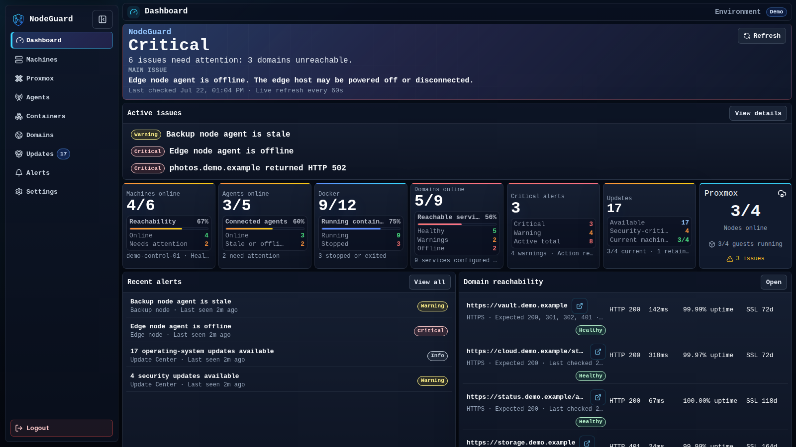
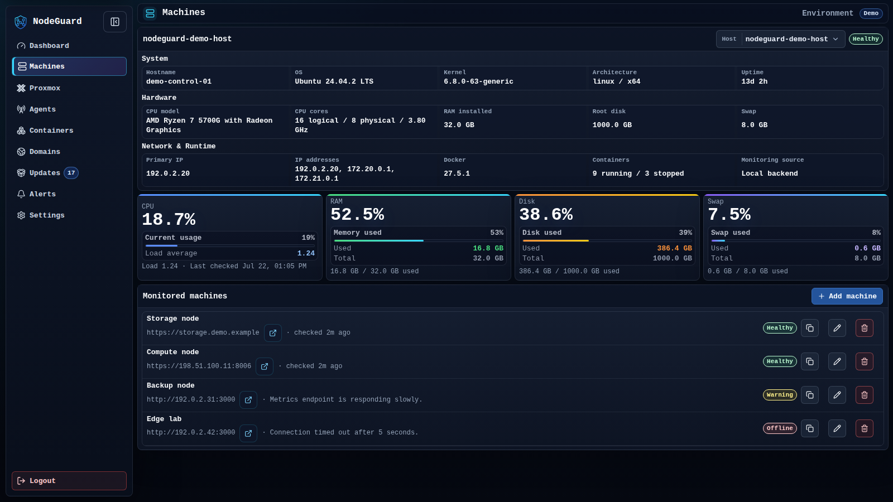
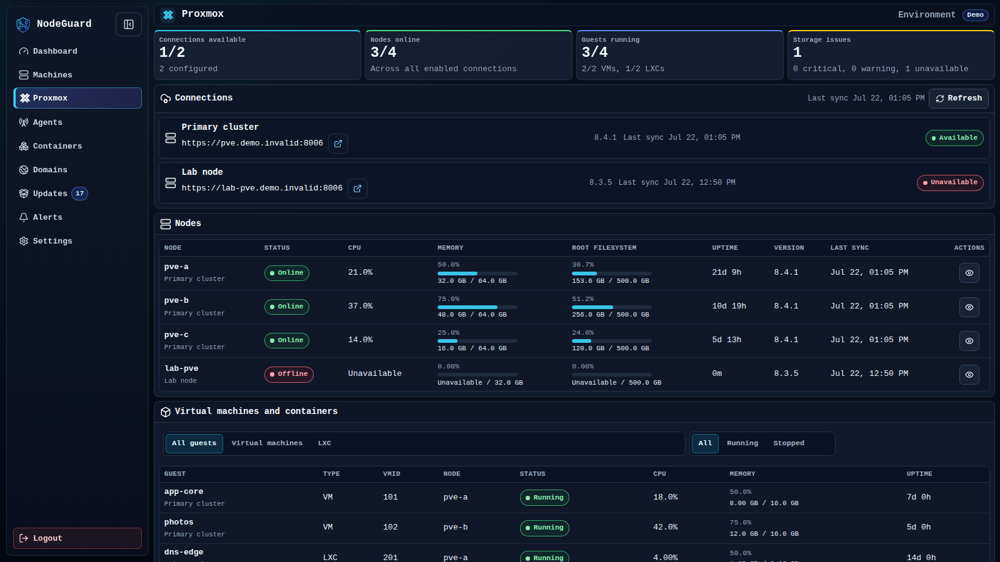
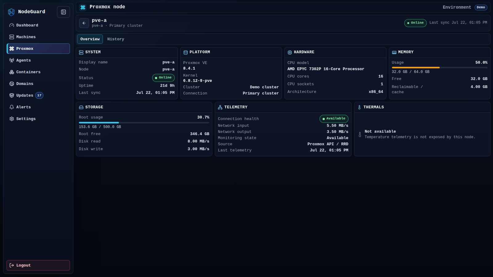
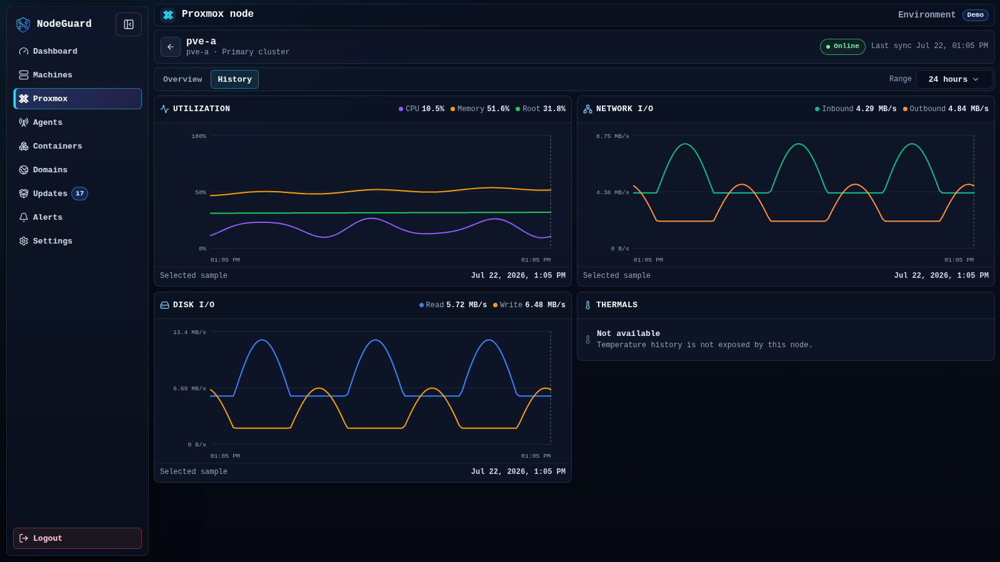
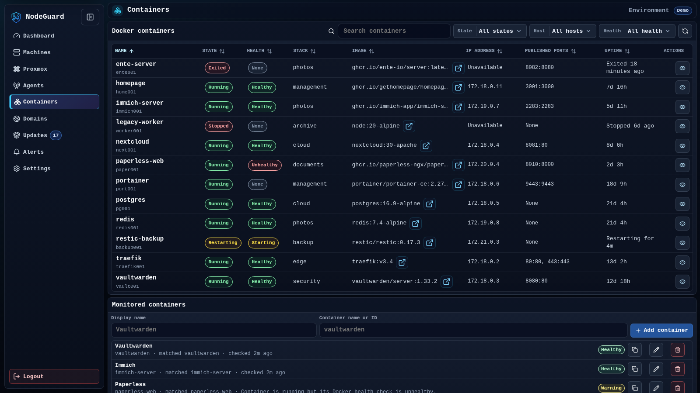
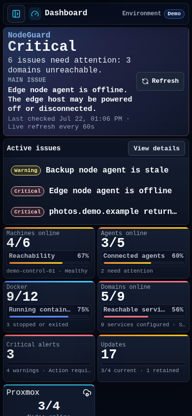
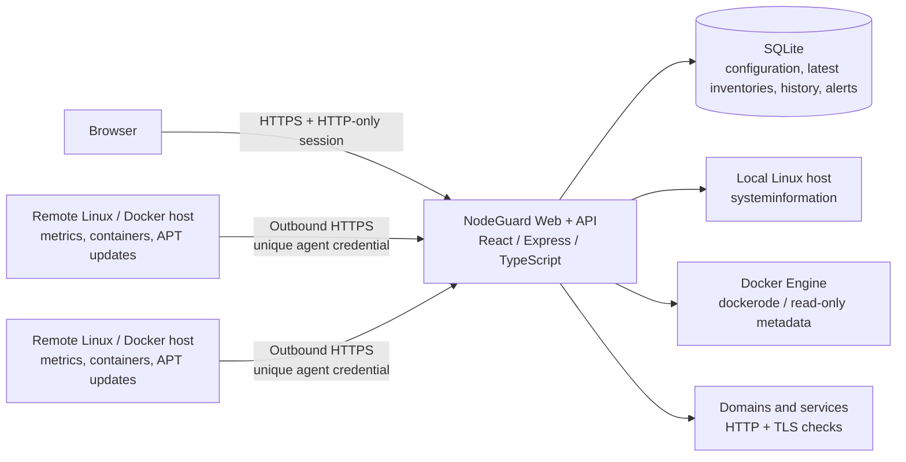

<!--
  Product screenshots are stored in screenshots/ and use only
  the isolated fictional demo environment.
-->

<div align="center">

# NodeGuard

### Monitor your servers. Protect your stack.

**A self-hosted infrastructure monitoring platform for Linux hosts, Docker workloads, domains, services, updates, and alerts.**

Built with React, TypeScript, Node.js, Go, SQLite, and Docker.

[**Live Demo**](https://nodeguard.muthu.eu) · [**Quick Start**](#quick-start) · [**Agent Setup**](#nodeguard-agent) · [**Architecture**](#architecture)


</div>

<p align="center">
  
</p>

> **Project status:** Active development. NodeGuard is deployed against a real self-hosted homelab, while the public demo uses a fully isolated fictional environment.
>
> **Screenshot note:** Every screenshot below was captured from the isolated demo account and contains fictional infrastructure data.

## Why I built NodeGuard

I built NodeGuard because many infrastructure-monitoring tools felt too complex for the quick operational questions I needed to answer in my homelab:

- Are my servers healthy?
- Which container or service needs attention?
- Is a domain reachable, slow, or close to SSL expiry?
- Are important updates available?
- What changed, and when did the problem begin?

NodeGuard brings those answers into one focused, read-only dashboard. The project is not only a frontend concept: it includes a TypeScript API, persistent monitoring history, a secure Go agent, Docker deployment, authentication, alert lifecycle management, and a live demo environment.

## Highlights

| | Capability | What it provides |
|---|---|---|
| **01** | **Unified infrastructure overview** | Health, active issues, resource status, recent alerts, monitored services, and update totals in one dashboard. |
| **02** | **Secure remote monitoring** | An outbound-only Go agent with one-time enrollment, stable machine identity, rotating per-agent credentials, diagnostics, safe reinstall, and systemd integration. |
| **03** | **Deep Docker visibility** | Searchable and sortable inventory with runtime state, health, image, stack, IP, ports, uptime, details, and bounded log previews. |
| **04** | **Service and domain monitoring** | Expected status codes, custom paths, latency trends, rolling 30-day uptime, SSL state, diagnostics, and manual checks. |
| **05** | **Persistent alert lifecycle** | Active and resolved incidents with first/last seen timestamps, occurrence counts, failed checks, likely causes, and suggested actions. |
| **06** | **Read-only update discovery** | Linux Agents discover APT package updates on Debian, Ubuntu, and Proxmox VE hosts, including security-origin and reboot-required status. |
| **07** | **Safe public demonstration** | Demo users are restricted at the backend to isolated fictional data and cannot access live infrastructure or configuration APIs. |
| **08** | **Production-style deployment** | A single Docker image serves the web UI and API, with SQLite persistence and HTTPS reverse-proxy support. |
| **09** | **Compact operational interface** | A shared action, typography, badge, and icon-control system keeps dense dashboards, forms, tables, and mobile cards consistent, with optically centered 14px action icons and practical touch targets. |

## NodeGuard in action

The isolated demo environment shows the same read-only monitoring workflows across desktop and mobile without exposing live infrastructure.

<p>
  
  <br>
  <sub><strong>Linux machine monitoring:</strong> Inspect host inventory, hardware, Docker runtime details, CPU, memory, disk, swap, and monitored endpoints from one compact view.</sub>
</p>

<p>
  
  <br>
  <sub><strong>Proxmox infrastructure:</strong> Follow connection availability, node capacity, virtual machines, LXC guests, storage, and synchronization state without exposing lifecycle controls.</sub>
</p>

<p>
  
  <br>
  <sub><strong>Node overview:</strong> A balanced operational summary of platform, hardware, capacity, storage, network telemetry, and data availability.</sub>
</p>

<p>
  
  <br>
  <sub><strong>Proxmox history:</strong> On-demand RRD charts for utilization, network traffic, and disk throughput across selectable time ranges.</sub>
</p>

<p>
  
  <br>
  <sub><strong>Docker workload visibility:</strong> Search and filter containers across hosts while keeping runtime state, Docker health, image, networking, ports, and uptime distinct.</sub>
</p>

<p align="center">
  
  <br>
  <sub><strong>Responsive operations:</strong> The same high-signal health and incident summary remains usable on a phone without horizontal scrolling.</sub>
</p>

## Live demo

Visit **[nodeguard.muthu.eu](https://nodeguard.muthu.eu)** and sign in with the isolated demo account:

```text
Username: demo
Password: demo
```

The demo environment contains fictional servers, Docker workloads, service states, metric trends, updates, and alert history. The live/demo boundary is enforced by the authenticated account on the backend rather than by a client-side mode switch.

## Features

### Dashboard

- Overall infrastructure status and primary issue summary
- Active issue count and real status breakdowns
- Coordinated server, Agent, Docker, domain/service, alert, update, and Proxmox summaries with stable loading states
- Recent alerts and service reachability
- Compact responsive composition that keeps summary metrics in a two-column phone grid without horizontal scrolling
- Responsive dark interface with compact 13px sidebar navigation, proportionate icons, and a balanced collapsed/mobile presentation
- Subtle motion with `prefers-reduced-motion` support
- Screenshot privacy mode for safer demos and portfolio captures

### Linux and Docker agents

- Secure one-time enrollment tokens
- Stable Agent-managed machine identity that is never inferred from a hostname
- Unique long-term credential per agent
- Outbound HTTPS communication only
- Heartbeats with online, stale, and offline states
- Linux host inventory and resource metrics
- Read-only Docker inventory and runtime health
- Scheduled APT metadata refresh and package-update discovery for Debian, Ubuntu, and Proxmox VE
- Security-origin package and reboot-required reporting with bounded package details
- Bounded in-memory retry queue during temporary outages
- Static Linux `amd64` and `arm64` releases
- Automated installation, checksum verification, systemd setup, upgrades, exact-identity re-enrollment, diagnostics, and safe uninstallation
- Agent rename, credential rotation, revocation, and separately confirmed permanent deletion

### Machines and resource history

- Local host metrics through `systeminformation`
- CPU, memory, disk, and swap summaries
- Persistent history across `1h`, `6h`, `24h`, `7d`, and `30d` ranges
- Additional NodeGuard backend or plain health-URL monitors
- Per-monitor self-signed HTTPS support for trusted internal services

### Proxmox VE

- Read-only multi-connection inventory for nodes, QEMU virtual machines, LXC containers, and storage
- Compact node detail pages with Overview and History tabs
- Balanced Overview card grid with four equal cards followed by three equal cards on wide screens, two columns on tablets, and natural-height cards on phones
- On-demand Proxmox RRD charts for CPU, memory, root storage, network I/O, and disk I/O across `1h`, `6h`, `12h`, `24h`, `7d`, `30d`, and `90d`
- Honest **Not available** treatment for optional fields and telemetry, including thermals when Proxmox does not supply samples
- No VM/LXC controls, no arbitrary API proxy, and no separate NodeGuard Proxmox time-series database

See **[`docs/PROXMOX.md`](docs/PROXMOX.md)** for token permissions, data sources, range mapping, security boundaries, and limitations.

### Docker containers

- Search, filters, sorting, and responsive mobile cards
- Runtime state and Docker health
- Host, Compose/Swarm stack, image, IP address, ports, and uptime
- Expandable details and bounded log preview
- Monitored-container checks for workloads that should exist and remain healthy
- Strictly read-only behavior: no start, stop, restart, delete, exec, or prune actions

### Domains and services

- Public domains, internal URLs, and reverse-proxy routes
- Custom paths such as `/health`, `/login`, or `/api/status`
- Configurable expected HTTP status codes
- Reachability, response time, rolling 30-day uptime, and SSL state
- Latency trends, expanded diagnostics, duplicate/edit/delete, and manual checks
- One retained history sample per minute to avoid excessive database growth

### Alerts

- Active, resolved, and all-history views
- Search, pagination, and operational detail columns
- First seen, last seen, occurrence count, and failed checks
- Possible cause and suggested next steps
- Persisted history with dismissal and deletion behavior
- Deduplicated recurring alerts

### Update Center

- Machine-focused inventory reported by authenticated NodeGuard Agents
- Search by machine, hostname, operating system, or package
- Available, security-origin, reboot-required, unsupported, delayed, failed, stale, and offline states
- Installed and candidate versions in an accessible machine-detail dialog
- Dashboard, sidebar, and Agent-detail update summaries
- Scheduled background checks with bounded retries and payloads
- Read-only discovery: the Agent may refresh APT metadata, but never installs, removes, configures, upgrades, or reboots

### Settings and diagnostics

- Refresh interval controls
- Screenshot privacy mode
- Diagnostics export
- Session information and logout
- Account-enforced Live and Demo environments

## Architecture



### Request and trust boundaries

- The browser never connects directly to Docker, SSH, a host shell, or the Docker socket.
- Human users authenticate with username/password sessions stored in HTTP-only cookies.
- Agents use separate machine credentials and never receive or reuse human passwords.
- Each Agent has its own credential; enrollment tokens are short-lived and single-use.
- Each Agent installation also has a root-owned random machine identity. It is not a secret or credential, is never inferred from the hostname, and only scopes token-authorized replacement to the same installation.
- Demo sessions are rejected at the backend boundary for live infrastructure, configuration, integration, and diagnostic APIs.
- Monitoring is intentionally read-only.

## Engineering decisions

### Read-only by design

NodeGuard focuses on visibility rather than remote administration. It does not expose shell access, package installation, reboots, or Docker lifecycle controls. This reduces the impact of an application compromise and keeps operational actions in the systems that own them.

### Outbound-only remote agent

The Go agent does not open an inbound listener. It collects a fixed set of Linux, Docker, and APT update data and sends reports to NodeGuard over outbound HTTPS. This avoids requiring inbound firewall rules or remote-shell access on monitored hosts. Update discovery uses only hard-coded package-manager operations and cannot accept commands from the server.

### Generated Agent protocol constants

`contracts/agent-contract.json` is the language-neutral source for Agent ingestion paths and the drift-sensitive APT update protocol vocabulary. `npm run contracts:generate` deterministically refreshes the tracked TypeScript and Go outputs; `npm run contracts:check` is read-only and fails when an output is missing or stale. Payload structures remain owned and validated in their existing Go and TypeScript modules rather than being broadly generated.

### Separate human and machine authentication

Human sessions, optional legacy machine API keys, enrollment tokens, stable machine identities, and per-Agent credentials have distinct purposes. The stable identity is a non-secret UUID stored separately under `/var/lib/nodeguard-agent`; it never authenticates a request. Agent credentials are stored in root-owned mode-`0600` configuration on the host and only as hashes by NodeGuard. Re-enrollment requires a valid one-time token, matches the exact stable identity, and rotates the credential transactionally without using hostname or display name as identity.

### Persistent but bounded monitoring history

SQLite stores resource trends, endpoint history, alerts, and configuration for a simple single-instance deployment. Sampling, retention, result limits, and agent retry buffers are bounded to prevent a fast UI refresh interval from creating unbounded storage or memory growth.

When an older `data/server-monitors.json` file is imported, NodeGuard encrypts any remote API keys in SQLite and removes the plaintext legacy file only after the transaction commits. An unreadable legacy file is preserved and reported in the API log for manual recovery.

### Server-enforced demo isolation

Demo Mode is not just mock data selected in the browser. The account identity determines the data mode, and the API rejects demo access to live infrastructure and sensitive configuration routes.

## Technology stack

| Layer | Technologies |
|---|---|
| **Frontend** | React, Vite, TypeScript, TanStack Query, Zustand, Lucide, custom CSS |
| **Backend** | Node.js, TypeScript, Express, SQLite, `better-sqlite3`, `systeminformation`, `dockerode` |
| **Security** | HTTP-only sessions, scrypt password hashes, Helmet, rate limiting, origin controls |
| **Agent** | Go 1.23+, Linux `/proc`, `/etc/os-release`, filesystem/network collectors, Docker Engine API, bounded APT discovery |
| **Deployment** | Docker, Docker Compose, HTTPS reverse proxy, persistent volumes |

## Repository structure

```text
nodeguard/
├── apps/
│   ├── web/                 # React + Vite dashboard
│   └── api/                 # Express + TypeScript API
├── agent/                   # Go monitoring agent and installer
├── agent-releases/          # Generated, untracked versioned Agent binaries and checksums
├── contracts/               # Canonical cross-language Agent protocol constants
├── docs/
│   ├── BACKUP_RESTORE.md     # Verified SQLite-volume backup and recovery procedure
│   ├── MACHINE_UPDATES.md    # Agent-reported package update architecture and operations
│   ├── PROXMOX.md            # Read-only Proxmox integration setup and security
│   ├── UI_AUDIT.md           # Current focused browser and interface audit
│   └── UI_UX_AUDIT.md        # Historical broad UI/UX audit
├── scripts/                 # Dependency-free contract generation and drift checks
├── screenshots/             # Tracked README and social product screenshots
├── docker-compose.yml       # Production deployment
├── Dockerfile               # Combined web/API image
├── .env.example             # Configuration template
└── README.md
```

## Quick start

### Local development

1. Install dependencies:

```bash
npm install
```

2. Create the API environment file:

```bash
cp .env.example apps/api/.env
```

3. Set at least these values in `apps/api/.env`:

```env
NODE_ENV=development
PORT=3000
NODEGUARD_ADMIN_USERNAME=admin
NODEGUARD_ADMIN_PASSWORD=change_this_local_password
NODEGUARD_DEMO_USERNAME=demo
NODEGUARD_DEMO_PASSWORD=demo
NODEGUARD_INTEGRATION_SECRET=generate_a_long_random_secret
ALLOWED_ORIGINS=http://localhost:3000,http://localhost:5173
DATABASE_URL=file:data/nodeguard.sqlite
```

Generate an integration secret with:

```bash
openssl rand -hex 32
```

4. Start the API and web app together:

```bash
npm run dev
```

5. Open:

```text
http://localhost:5173
```

The admin account always uses live data. The demo account is always restricted to the isolated fictional environment.

### Production with Docker Compose

1. Create the root environment file:

```bash
cp .env.example .env
```

2. Configure strong admin, demo, and integration secrets.

3. Build and start NodeGuard:

```bash
docker compose up -d --build
```

4. Follow the logs:

```bash
docker compose logs -f nodeguard
```

5. Stop the deployment:

```bash
docker compose down
```

The Compose deployment persists SQLite data under `/data` and mounts `/var/run/docker.sock` read-only for Docker metadata. The Docker socket remains highly privileged despite the read-only mount and fixed application behavior; review the deployment and restrict access to the NodeGuard host.

Use the consistency-checked, recovery-safe workflow in **[`docs/BACKUP_RESTORE.md`](docs/BACKUP_RESTORE.md)** to back up or restore the SQLite volume. Live backups use SQLite's online backup API; restores require a graceful API stop, an explicit confirmation, source verification, and a preserved pre-restore copy.

For internet exposure, place NodeGuard behind HTTPS and an additional access layer such as Cloudflare Access or a VPN.

## NodeGuard Agent

See **[`agent/README.md`](agent/README.md)** for complete installation, upgrade, systemd, troubleshooting, buffering, Docker-socket, and uninstallation guidance.

From **Agents → Add Agent**, generate and run the one-command installer:

```bash
curl -fsSL https://nodeguard.muthu.eu/install-agent.sh | sudo bash -s -- \
  --server https://nodeguard.muthu.eu
```

Copy the short-lived token shown by NodeGuard separately; the installer requests it through a hidden terminal prompt.

The installer:

1. Detects the Linux distribution and CPU architecture.
2. Downloads the matching `amd64` or `arm64` release.
3. Verifies the SHA-256 checksum.
4. Creates or preserves a protected stable machine identity.
5. Exchanges the one-time token for a unique Agent credential.
6. Installs the binary, root-owned configuration, and systemd service atomically.
7. Starts the service and verifies authenticated connectivity.

The installer prompts for the one-time token through the controlling terminal so it is not placed in the generated command or long-lived process arguments. For unattended automation, provide `NODEGUARD_ENROLLMENT_TOKEN` through a suitably protected environment and use `--non-interactive`.

Managed local paths are:

```text
/usr/local/bin/nodeguard-agent              binary (0755)
/etc/nodeguard-agent/config.json            credential/configuration (root, 0600)
/var/lib/nodeguard-agent/machine-id         stable non-secret identity (root, 0600)
/etc/systemd/system/nodeguard-agent.service systemd unit (0644)
```

Useful commands:

```bash
nodeguard-agent --help
nodeguard-agent version
sudo nodeguard-agent status
sudo nodeguard-agent status --json
sudo nodeguard-agent doctor
sudo nodeguard-agent config show
sudo nodeguard-agent config validate
sudo systemctl status nodeguard-agent
sudo journalctl -u nodeguard-agent -f
sudo systemctl restart nodeguard-agent
```

Running the installer again inspects the existing binary, service, configuration, credential, and stable identity. A healthy current installation is left intact unless `--force-reinstall` is requested. If the Agent was revoked/deleted or its credential is stale, a fresh one-time token re-enrolls the exact same machine identity and rotates the credential; hostname collisions never replace another Agent. A normal uninstall removes the service, binary, credential, configuration, and runtime cache but preserves `/var/lib/nodeguard-agent/machine-id` so a later reinstall can reclaim the same registration. Purge is explicit and destructive:

```bash
sudo nodeguard-agent uninstall
sudo nodeguard-agent uninstall --purge
sudo nodeguard-agent uninstall --purge --yes  # non-interactive confirmation
```

Normal uninstall is local-only and deliberately leaves the backend registration/history in NodeGuard. Revoke or permanently delete that record from **Agents** when appropriate. See the Agent guide for `enroll`, `re-enroll --replace-existing`, installer flags, recovery, exit codes, and troubleshooting.

The Agent has no inbound listener, remote shell, generic command execution, update installation, reboot, or Docker lifecycle endpoints. It can refresh local APT metadata with fixed arguments so update discovery remains accurate.

## Configuration

### Key environment variables

| Variable | Purpose |
|---|---|
| `NODEGUARD_HOST` | API bind address; defaults to `0.0.0.0` for container deployments (the E2E suite binds only to `127.0.0.1`) |
| `NODEGUARD_ADMIN_USERNAME` | Live owner/admin username |
| `NODEGUARD_ADMIN_PASSWORD` | Live owner/admin password |
| `NODEGUARD_DEMO_USERNAME` | Isolated demo username |
| `NODEGUARD_DEMO_PASSWORD` | Isolated demo password |
| `NODEGUARD_INTEGRATION_SECRET` | Encrypts saved Proxmox credentials and remote server-monitor API keys at rest |
| `DATABASE_URL` | SQLite database location |
| `ALLOWED_ORIGINS` | Allowed separate frontend origins |
| `TRUST_PROXY` | Numeric count of trusted reverse-proxy hops (`0` when none) |
| `SESSION_COOKIE_SECURE` | `auto`, `true`, or `false` cookie behavior |
| `VITE_NODEGUARD_SUPPORT_URL` | Optional public HTTPS support link embedded in the frontend build |
| `METRIC_HISTORY_RETENTION_DAYS` | Minute history and raw Agent-metric retention period (minimum 30 days) |
| `AGENT_UPDATE_INTERVAL_SECONDS` | Agent package-update check interval; defaults to 6 hours and is clamped to the safe minimum |
| `AGENT_STALE_AFTER_SECONDS` | Time before an agent is marked stale |
| `AGENT_OFFLINE_AFTER_SECONDS` | Time before an agent is marked offline |

`VITE_NODEGUARD_SUPPORT_URL` is public build-time configuration. NodeGuard shows the support action only for a valid `https://` URL; a missing or invalid value hides it. Never place PayPal credentials or other secrets in `VITE_*` variables.

<details>
<summary><strong>View the full environment-variable reference</strong></summary>

```env
NODE_ENV=development
PORT=3000
VITE_NODEGUARD_SUPPORT_URL=https://ko-fi.com/hackintoshmatrix
NODEGUARD_ADMIN_USERNAME=admin
NODEGUARD_ADMIN_PASSWORD=replace_me
NODEGUARD_DEMO_USERNAME=demo
NODEGUARD_DEMO_PASSWORD=demo
NODEGUARD_INTEGRATION_SECRET=replace_with_at_least_32_random_bytes
SESSION_DURATION_DAYS=7
REMEMBERED_SESSION_DURATION_DAYS=30
SESSION_COOKIE_NAME=nodeguard_session
SESSION_COOKIE_SECURE=auto
NODEGUARD_API_KEY=optional_legacy_machine_key
ALLOWED_ORIGINS=http://localhost:3000,http://localhost:5173
DATABASE_URL=file:data/nodeguard.sqlite
TRUST_PROXY=0
REQUEST_JSON_LIMIT=512kb
RATE_LIMIT_WINDOW_MS=60000
RATE_LIMIT_MAX=1200
WEB_DIST_DIR=apps/web/dist
MONITORED_DOMAINS=https://example.com,https://status.example.com
SERVER_DISPLAY_NAME=local-nodeguard-host
LOG_PREVIEW_LINES=80
DOMAIN_CHECK_TIMEOUT_MS=5000
AGENT_INSTALLER_PATH=agent/install-agent.sh
AGENT_RELEASE_DIR=agent-releases
AGENT_RELEASE_VERSION=0.3.1
AGENT_ENROLLMENT_TTL_MINUTES=10
AGENT_HEARTBEAT_INTERVAL_SECONDS=20
AGENT_METRICS_INTERVAL_SECONDS=30
AGENT_DOCKER_INTERVAL_SECONDS=60
AGENT_INVENTORY_INTERVAL_SECONDS=21600
AGENT_UPDATE_INTERVAL_SECONDS=21600
AGENT_STALE_AFTER_SECONDS=75
AGENT_OFFLINE_AFTER_SECONDS=180
AGENT_TIMESTAMP_TOLERANCE_SECONDS=900
AGENT_MAX_CONTAINERS=500
AGENT_RATE_LIMIT_MAX=600
AGENT_ENROLLMENT_RATE_LIMIT_MAX=10
METRIC_SAMPLE_INTERVAL_SECONDS=60
METRIC_HISTORY_RETENTION_DAYS=30
CPU_WARNING_PERCENT=80
CPU_CRITICAL_PERCENT=90
MEMORY_WARNING_PERCENT=80
MEMORY_CRITICAL_PERCENT=90
DISK_WARNING_PERCENT=80
DISK_CRITICAL_PERCENT=90

# Proxmox VE read-only integration
NODEGUARD_PROXMOX_SYNC_INTERVAL_SECONDS=30
NODEGUARD_PROXMOX_FAILURE_THRESHOLD=3
NODEGUARD_PROXMOX_STORAGE_WARNING_PERCENT=80
NODEGUARD_PROXMOX_STORAGE_CRITICAL_PERCENT=90
NODEGUARD_PROXMOX_REQUEST_TIMEOUT_MS=10000
```

Never commit `.env` files, API keys, access tokens, passwords, private IP addresses, database files, or generated diagnostics.

</details>

## Machine update discovery

NodeGuard Agents discover operating-system package updates on Debian, Ubuntu, and Proxmox VE machines. Shortly after startup, each Agent refreshes APT metadata with strict partial-failure detection, reads `apt list --upgradable` with fixed shell-free arguments, reports security-origin packages and the standard reboot-required indicator, then sends a bounded inventory over its existing authenticated outbound connection.

Unknown, failed, busy, unsupported, retained, and stale inventories remain distinct from a confirmed zero-update result. Later failures do not erase the last successful counts or package details, and the UI separates the latest attempted check from the latest successful inventory.

The NodeGuard API reads only the latest report stored in SQLite. Opening the Updates page never runs APT, connects to a machine, or starts a remote command. NodeGuard does not install, remove, configure, or upgrade packages and cannot reboot a machine. See **[`docs/MACHINE_UPDATES.md`](docs/MACHINE_UPDATES.md)** for architecture, supported states, security boundaries, configuration, and troubleshooting.

## API overview

<details>
<summary><strong>View API routes</strong></summary>

### Public

```text
GET /health
GET /install-agent.sh
GET /agent/releases/latest/version
GET /agent/releases/:version/nodeguard-agent-linux-amd64
GET /agent/releases/:version/nodeguard-agent-linux-arm64
GET /agent/releases/:version/checksums.txt
```

### Authentication

```text
GET  /api/auth/me
POST /api/auth/login
POST /api/auth/logout
```

### Protected application routes

```text
GET    /api/overview
GET    /api/servers
GET    /api/servers/monitors
POST   /api/servers/monitors
PUT    /api/servers/monitors/:id
DELETE /api/servers/monitors/:id
GET    /api/servers/:id
GET    /api/servers/:id/metrics
GET    /api/servers/:id/metrics/history?range=1h|6h|24h|7d|30d
GET    /api/servers/:id/containers
GET    /api/containers
GET    /api/containers/monitors
POST   /api/containers/monitors
PUT    /api/containers/monitors/:id
DELETE /api/containers/monitors/:id
GET    /api/containers/:id
GET    /api/domains
POST   /api/domains
PUT    /api/domains/:id
DELETE /api/domains/:id
GET    /api/alerts
GET    /api/alerts?status=all
GET    /api/alerts?status=resolved
GET    /api/alerts/:id
DELETE /api/alerts/:id
GET    /api/updates
GET    /api/updates/machines/:agentId
GET    /api/proxmox
GET    /api/proxmox/connections/:id/nodes/:node
GET    /api/proxmox/connections/:id/nodes/:node/history?range=1h|6h|12h|24h|7d|30d|90d
POST   /api/checks/run
```

### Owner/admin agent management

```text
GET    /api/agents
GET    /api/agents/:id
PUT    /api/agents/:id
GET    /api/agents/enrollment-tokens
GET    /api/agents/enrollment-tokens/:id/status
POST   /api/agents/enrollment-tokens
DELETE /api/agents/enrollment-tokens/:id
POST   /api/agents/:id/rotate-credential
POST   /api/agents/:id/revoke
DELETE /api/agents/:id
```

### Agent ingestion API

```text
POST /api/agent/register
GET  /api/agent/status
POST /api/agent/heartbeat
POST /api/agent/inventory
POST /api/agent/metrics
POST /api/agent/docker
POST /api/agent/updates
```

Agent v0.3 registration includes a stable non-secret machine identity and an idempotent client-generated credential. An exact retry can recover from a lost registration response; replacement still requires a valid token and can affect only the matching identity.

Protected application routes require a signed-in session. Optional `Authorization: Bearer <api-key>` and `x-api-key: <api-key>` support remains available for machine-to-machine callers.

</details>

## Scripts

```bash
npm run dev          # Start API and web development servers
npm run dev:api      # Start only the API
npm run dev:web      # Start only the web client
npm run contracts:generate # Regenerate tracked Agent contract outputs
npm run contracts:check # Verify generated Agent contracts without writing files
npm run contracts:test # Test manifest validation and drift detection
npm run build        # Build the project
npm run typecheck    # Run TypeScript checks
npm run lint         # Run linting
npm test             # Run tests
npm run test:e2e     # Run Chromium browser end-to-end tests
npm run test:e2e:install # Install the Chromium browser used by Playwright
```

The browser suite starts an isolated loopback-only API and a production-built Vite preview, uses an in-memory SQLite database, and verifies login, navigation, live configuration mutations, responsive layouts, and browser/network diagnostics. GitHub Actions runs the API/web checks and this suite on every pull request and push to `main`.

## Security notes

- NodeGuard is a monitoring tool, not a replacement for network segmentation, host hardening, backups, or an identity-aware access proxy.
- Use HTTPS for all non-local deployments.
- Human passwords are stored as scrypt hashes; sessions use HTTP-only cookies.
- Production startup requires configured admin and demo passwords.
- Demo sessions cannot access live infrastructure, integrations, configuration, or diagnostics.
- Raw backend errors are hidden in production.
- The frontend never receives direct Docker-socket, shell, SSH, or privileged host access.
- Agent enrollment tokens expire and become invalid after one use.
- Stable machine identities are random, non-secret, stored separately with root-only permissions, and never inferred from hostnames.
- Long-term agent credentials are unique per host and can be rotated or revoked.
- Re-enrollment is token-authorized and exact-identity scoped; it invalidates the previous credential without replacing unrelated Agents.
- Agent update reports contain package metadata only; commands, repository credentials, raw command output, and environment variables are never accepted or exposed.
- Docker-socket access is highly privileged even when mounted read-only. Review the source, restrict host access, and disable Docker collection where it is not needed.
- Keep `.env` files, database files, logs, tokens, private IP addresses, and generated diagnostics out of version control.

## Known limitations

- SQLite targets a single NodeGuard instance and homelab-scale deployment.
- Local-backend per-container CPU usage is unavailable; agents report it where the Docker Engine exposes a valid one-shot sample.
- Push, email, and mobile notifications are not implemented yet.
- Agent retry buffering is memory-only and does not survive an Agent process restart.
- Multi-user roles, password reset, and two-factor authentication are not yet available.
- NodeGuard provides monitoring and diagnostics, not remote remediation.

## Roadmap

- Additional read-only package providers beyond APT and optional reliable Agent-to-Proxmox identity linking
- Notification channels for critical and recovery events
- Multi-user roles and stronger account-management flows
- Expanded agent metrics and historical analysis
- Optional external database support for larger deployments

## Portfolio demo flow

1. Sign in with the public `demo` account and explain that its data boundary is enforced by the backend.
2. Start on **Dashboard** and walk through the overall status, main issue, active incidents, fleet availability, Docker health, updates, and domain reachability.
3. Open **Machines** and change a resource-history time range to demonstrate persistent metrics.
4. Open **Agents**, select a host, and explain outbound-only reporting, inventory, heartbeats, and unique per-agent credentials.
5. Open **Containers**, use the state/host/health filters, and inspect a monitored workload.
6. Open **Domains**, expand an endpoint, and show expected HTTP responses, latency, rolling uptime, SSL state, and diagnostics.
7. Open **Alerts**, select an incident, and explain first/last seen timestamps, occurrences, failed checks, likely cause, and suggested next steps.
8. Open **Updates** and inspect a machine's available packages, security-origin updates, reboot state, and last successful Agent check.
9. Finish in **Settings** by showing the demo-only session, refresh controls, and hidden live configuration and diagnostics.

## Support NodeGuard

NodeGuard is an independent project. Support helps cover hosting costs and continued development of new integrations, performance improvements, and features.

[](https://ko-fi.com/hackintoshmatrix)

## License

NodeGuard is available under the [MIT License](LICENSE).

---

<div align="center">

**NodeGuard — clear, read-only infrastructure visibility for self-hosted environments.**

[Live Demo](https://nodeguard.muthu.eu) · [Back to top](#nodeguard)

</div>
