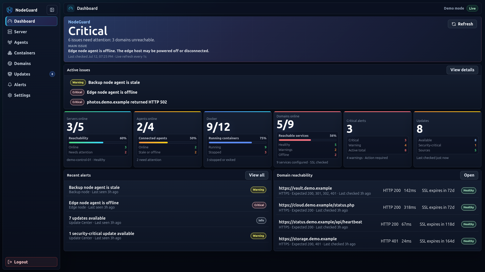
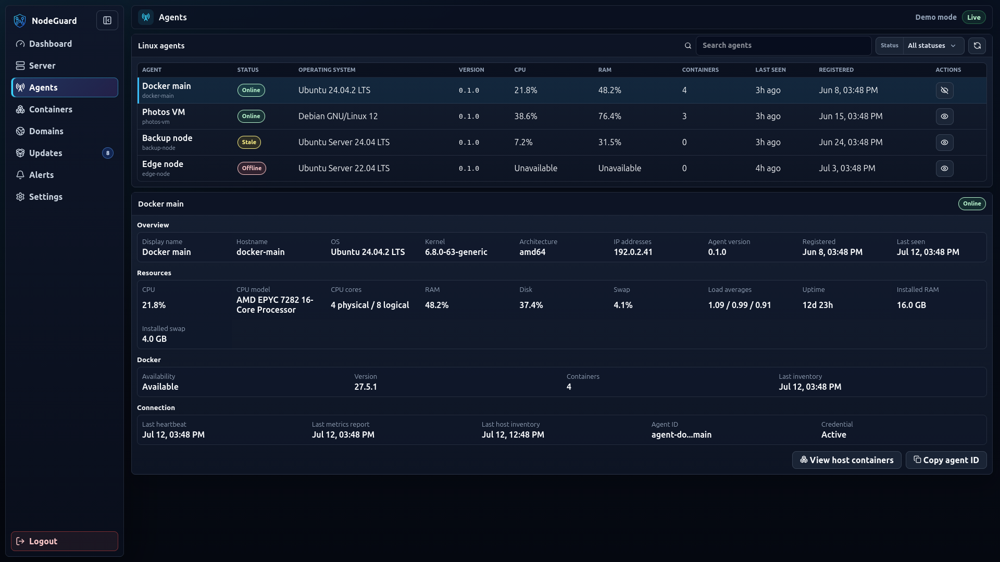
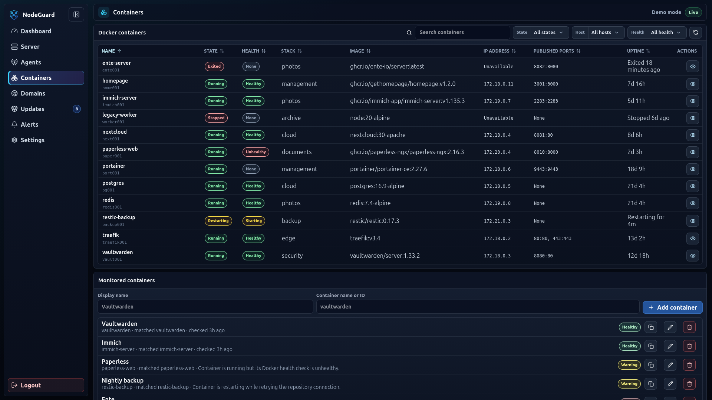
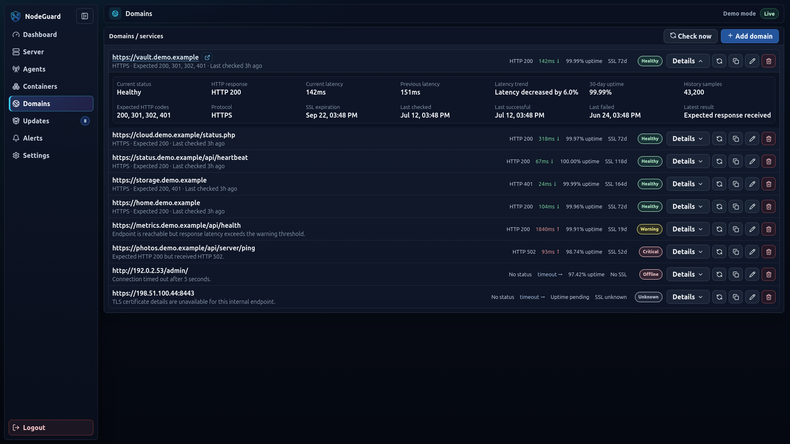
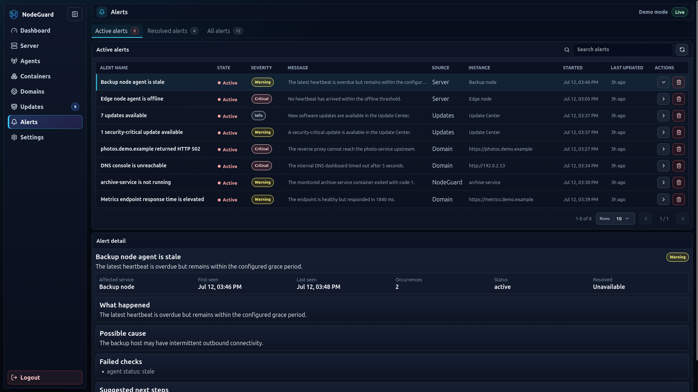
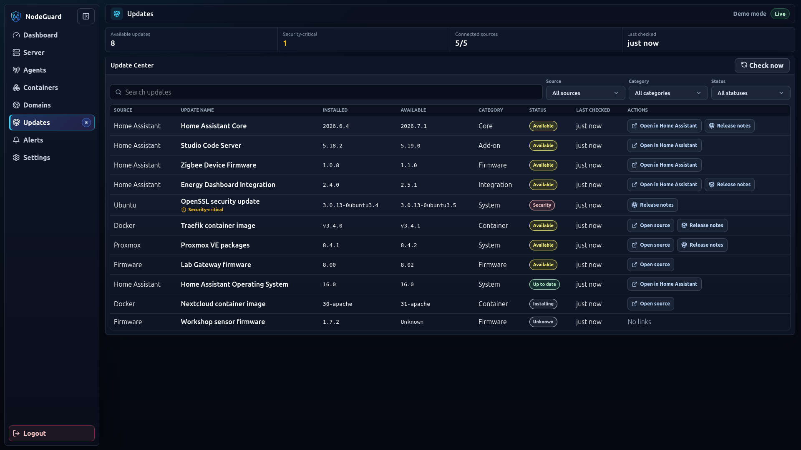
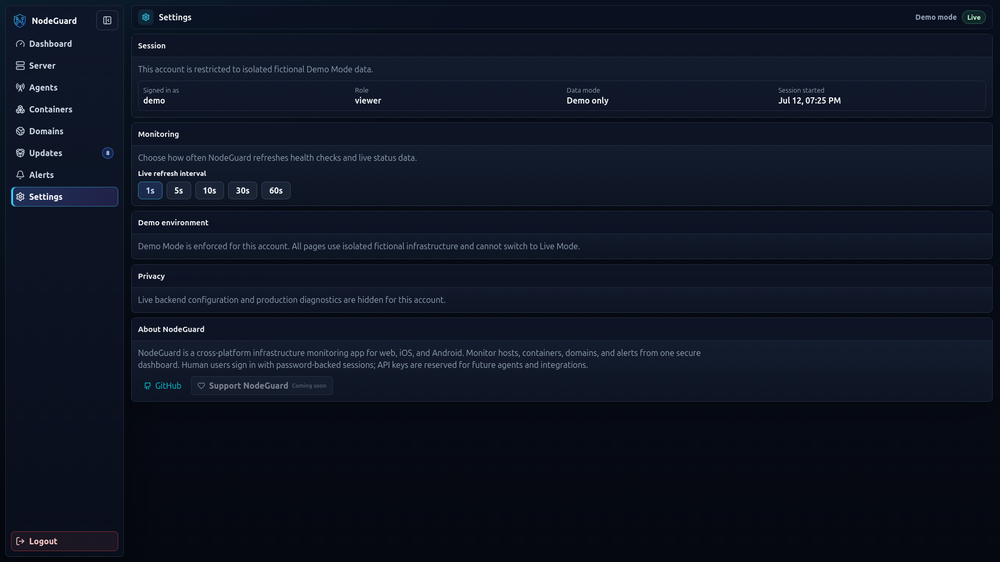
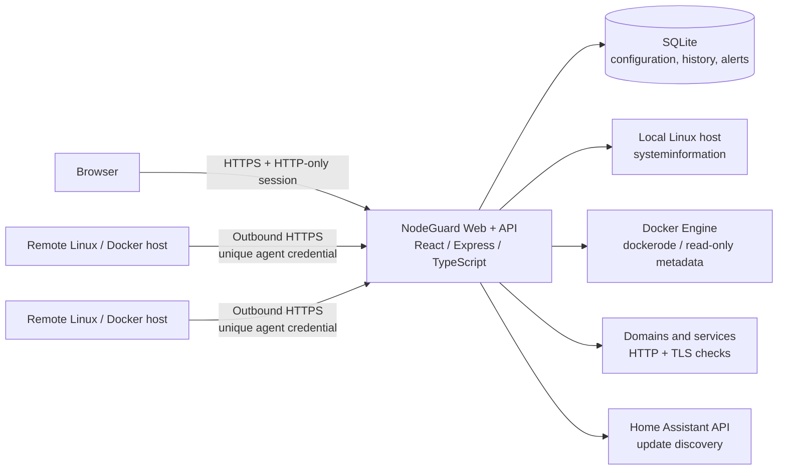

<!--
  Product screenshots are stored in docs/screenshots/ and use only
  the isolated fictional demo environment.
-->

<div align="center">

# NodeGuard

### Monitor your servers. Protect your stack.

**A self-hosted infrastructure monitoring platform for Linux hosts, Docker workloads, domains, services, updates, and alerts.**

Built with React, TypeScript, Node.js, Go, SQLite, and Docker.

[**Live Demo**](https://nodeguard.muthu.eu) · [**Quick Start**](#quick-start) · [**Agent Setup**](#nodeguard-agent) · [**Architecture**](#architecture)


</div>

<p align="center">
  
</p>

> **Project status:** Active development. NodeGuard is deployed against a real self-hosted homelab, while the public demo uses a fully isolated fictional environment.
>
> **Screenshot note:** Every screenshot below was captured from the isolated demo account and contains fictional infrastructure data.

## Why I built NodeGuard

I built NodeGuard because many infrastructure-monitoring tools felt too complex for the quick operational questions I needed to answer in my homelab:

- Are my servers healthy?
- Which container or service needs attention?
- Is a domain reachable, slow, or close to SSL expiry?
- Are important updates available?
- What changed, and when did the problem begin?

NodeGuard brings those answers into one focused, read-only dashboard. The project is not only a frontend concept: it includes a TypeScript API, persistent monitoring history, a secure Go agent, Docker deployment, authentication, alert lifecycle management, and a live demo environment.

## Highlights

| | Capability | What it provides |
|---|---|---|
| **01** | **Unified infrastructure overview** | Health, active issues, resource status, recent alerts, monitored services, and update totals in one dashboard. |
| **02** | **Secure remote monitoring** | An outbound-only Go agent with one-time enrollment, unique per-agent credentials, heartbeats, retry buffering, and systemd integration. |
| **03** | **Deep Docker visibility** | Searchable and sortable inventory with runtime state, health, image, stack, IP, ports, uptime, details, and bounded log previews. |
| **04** | **Service and domain monitoring** | Expected status codes, custom paths, latency trends, rolling 30-day uptime, SSL state, diagnostics, and manual checks. |
| **05** | **Persistent alert lifecycle** | Active and resolved incidents with first/last seen timestamps, occurrence counts, failed checks, likely causes, and suggested actions. |
| **06** | **Read-only update discovery** | A shared update model with Home Assistant integration, release information, search, filters, and deduplicated update alerts. |
| **07** | **Safe public demonstration** | Demo users are restricted at the backend to isolated fictional data and cannot access live infrastructure or configuration APIs. |
| **08** | **Production-style deployment** | A single Docker image serves the web UI and API, with SQLite persistence and HTTPS reverse-proxy support. |

## Product tour

The dashboard above provides the high-level operational view. The pages below show how NodeGuard turns that summary into host inventory, container visibility, endpoint diagnostics, update discovery, and actionable incident context.

<table>
  <tr>
    <td width="50%" valign="top">
      
      <br>
      <strong>Multi-host Linux agent fleet</strong><br>
      Track online, stale, and offline hosts, then inspect operating-system inventory, CPU, RAM, storage, uptime, Docker availability, heartbeats, and agent credentials from one place.
    </td>
    <td width="50%" valign="top">
      
      <br>
      <strong>Docker workload visibility</strong><br>
      Search, sort, and filter container inventory across hosts; inspect runtime state, Docker health, stack, image, network information, published ports, uptime, and monitored-workload status.
    </td>
  </tr>
  <tr>
    <td width="50%" valign="top">
      
      <br>
      <strong>Domains and service diagnostics</strong><br>
      Monitor public and internal endpoints with expected HTTP codes, latency trends, rolling 30-day uptime, SSL expiry, detailed results, manual checks, and reusable monitor configuration.
    </td>
    <td width="50%" valign="top">
      
      <br>
      <strong>Actionable alert history</strong><br>
      Move beyond a simple red status: each incident retains severity, first and last seen times, occurrences, failed checks, a likely cause, and suggested next steps.
    </td>
  </tr>
  <tr>
    <td width="50%" valign="top">
      
      <br>
      <strong>Read-only Update Center</strong><br>
      Normalize updates from multiple sources into a searchable inventory with installed and available versions, categories, security-critical status, source links, and release notes.
    </td>
    <td width="50%" valign="top">
      
      <br>
      <strong>Backend-enforced demo isolation</strong><br>
      The public demo account is permanently restricted to fictional data. Session identity determines the data boundary, while live configuration and production diagnostics stay unavailable.
    </td>
  </tr>
</table>

## Live demo

Visit **[nodeguard.muthu.eu](https://nodeguard.muthu.eu)** and sign in with the isolated demo account:

```text
Username: demo
Password: demo
```

The demo environment contains fictional servers, Docker workloads, service states, metric trends, updates, and alert history. The live/demo boundary is enforced by the authenticated account on the backend rather than by a client-side mode switch.

## Features

### Dashboard

- Overall infrastructure status and primary issue summary
- Active issue count and real status breakdowns
- Server, Docker, domain/service, alert, and update summaries
- Recent alerts and service reachability
- Responsive dark interface with collapsible navigation
- Subtle motion with `prefers-reduced-motion` support
- Screenshot privacy mode for safer demos and portfolio captures

### Linux and Docker agents

- Secure one-time enrollment tokens
- Unique long-term credential per agent
- Outbound HTTPS communication only
- Heartbeats with online, stale, and offline states
- Linux host inventory and resource metrics
- Read-only Docker inventory and runtime health
- Bounded in-memory retry queue during temporary outages
- Static Linux `amd64` and `arm64` releases
- Automated installation, checksum verification, systemd setup, upgrades, and uninstallation
- Agent rename, credential rotation, revocation, and separately confirmed permanent deletion

### Servers and resource history

- Local host metrics through `systeminformation`
- CPU, memory, disk, and swap summaries
- Persistent history across `1h`, `6h`, `24h`, `7d`, and `30d` ranges
- Additional NodeGuard backend or plain health-URL monitors
- Per-monitor self-signed HTTPS support for trusted internal services

### Docker containers

- Search, filters, sorting, and responsive mobile cards
- Runtime state and Docker health
- Host, Compose/Swarm stack, image, IP address, ports, and uptime
- Expandable details and bounded log preview
- Monitored-container checks for workloads that should exist and remain healthy
- Strictly read-only behavior: no start, stop, restart, delete, exec, or prune actions

### Domains and services

- Public domains, internal URLs, and reverse-proxy routes
- Custom paths such as `/health`, `/login`, or `/api/status`
- Configurable expected HTTP status codes
- Reachability, response time, rolling 30-day uptime, and SSL state
- Latency trends, expanded diagnostics, duplicate/edit/delete, and manual checks
- One retained history sample per minute to avoid excessive database growth

### Alerts

- Active, resolved, and all-history views
- Search, pagination, and operational detail columns
- First seen, last seen, occurrence count, and failed checks
- Possible cause and suggested next steps
- Persisted history with dismissal and deletion behavior
- Deduplicated recurring alerts

### Update Center

- Shared source model designed for multiple integrations
- Searchable and filterable update inventory
- Installed and available versions, categories, states, source links, and release notes
- Dashboard and sidebar update totals
- Backend-only Home Assistant long-lived access tokens
- Encrypted integration credentials at rest
- Manual and scheduled refreshes
- Read-only discovery: updates are never installed by NodeGuard

### Settings and diagnostics

- Refresh interval controls
- Screenshot privacy mode
- Diagnostics export
- Session information and logout
- Home Assistant update-source configuration
- Account-enforced Live and Demo environments

## Architecture



### Request and trust boundaries

- The browser never connects directly to Docker, SSH, a host shell, or the Docker socket.
- Human users authenticate with username/password sessions stored in HTTP-only cookies.
- Agents use separate machine credentials and never receive or reuse human passwords.
- Each agent has its own credential; enrollment tokens are short-lived and single-use.
- Demo sessions are rejected at the backend boundary for live infrastructure, configuration, integration, and diagnostic APIs.
- Monitoring is intentionally read-only.

## Engineering decisions

### Read-only by design

NodeGuard focuses on visibility rather than remote administration. It does not expose shell access, package installation, reboots, or Docker lifecycle controls. This reduces the impact of an application compromise and keeps operational actions in the systems that own them.

### Outbound-only remote agent

The Go agent does not open an inbound listener. It collects a fixed set of Linux and Docker data and sends reports to NodeGuard over outbound HTTPS. This avoids requiring inbound firewall rules or remote-shell access on monitored hosts.

### Separate human and machine authentication

Human sessions, optional legacy machine API keys, enrollment tokens, and per-agent credentials have distinct purposes. Agent credentials are shown only when issued, stored in root-owned mode-`0600` configuration on the host, and stored as hashes by NodeGuard.

### Persistent but bounded monitoring history

SQLite stores resource trends, endpoint history, alerts, and configuration for a simple single-instance deployment. Sampling, retention, result limits, and agent retry buffers are bounded to prevent a fast UI refresh interval from creating unbounded storage or memory growth.

### Server-enforced demo isolation

Demo Mode is not just mock data selected in the browser. The account identity determines the data mode, and the API rejects demo access to live infrastructure and sensitive configuration routes.

## Technology stack

| Layer | Technologies |
|---|---|
| **Frontend** | React, Vite, TypeScript, TanStack Query, Zustand, Lucide, custom CSS |
| **Backend** | Node.js, TypeScript, Express, SQLite, `better-sqlite3`, `systeminformation`, `dockerode` |
| **Security** | HTTP-only sessions, scrypt password hashes, Helmet, rate limiting, origin controls |
| **Agent** | Go 1.23+, Linux `/proc`, `/etc/os-release`, filesystem/network collectors, Docker Engine API |
| **Deployment** | Docker, Docker Compose, HTTPS reverse proxy, persistent volumes |

## Repository structure

```text
nodeguard/
├── apps/
│   ├── web/                 # React + Vite dashboard
│   └── api/                 # Express + TypeScript API
├── agent/                   # Go monitoring agent and installer
├── agent-releases/          # Versioned agent binaries and checksums
├── docs/
│   └── screenshots/         # README product screenshots
├── docker-compose.yml       # Production deployment
├── Dockerfile               # Combined web/API image
├── .env.example             # Configuration template
└── README.md
```

## Quick start

### Local development

1. Install dependencies:

```bash
npm install
```

2. Create the API environment file:

```bash
cp .env.example apps/api/.env
```

3. Set at least these values in `apps/api/.env`:

```env
NODE_ENV=development
PORT=3000
NODEGUARD_ADMIN_USERNAME=admin
NODEGUARD_ADMIN_PASSWORD=change_this_local_password
NODEGUARD_DEMO_USERNAME=demo
NODEGUARD_DEMO_PASSWORD=demo
NODEGUARD_INTEGRATION_SECRET=generate_a_long_random_secret
ALLOWED_ORIGINS=http://localhost:3000,http://localhost:5173
DATABASE_URL=file:data/nodeguard.sqlite
```

Generate an integration secret with:

```bash
openssl rand -hex 32
```

4. Start the API and web app together:

```bash
npm run dev
```

5. Open:

```text
http://localhost:5173
```

The admin account always uses live data. The demo account is always restricted to the isolated fictional environment.

### Production with Docker Compose

1. Create the root environment file:

```bash
cp .env.example .env
```

2. Configure strong admin, demo, and integration secrets.

3. Build and start NodeGuard:

```bash
docker compose up -d --build
```

4. Follow the logs:

```bash
docker compose logs -f nodeguard
```

5. Stop the deployment:

```bash
docker compose down
```

The Compose deployment persists SQLite data under `/data` and mounts `/var/run/docker.sock` read-only for Docker metadata. The Docker socket remains highly privileged despite the read-only mount and fixed application behavior; review the deployment and restrict access to the NodeGuard host.

For internet exposure, place NodeGuard behind HTTPS and an additional access layer such as Cloudflare Access or a VPN.

## NodeGuard Agent

See **[`agent/README.md`](agent/README.md)** for complete installation, upgrade, systemd, troubleshooting, buffering, Docker-socket, and uninstallation guidance.

From **Agents → Add Agent**, generate and run the one-command installer:

```bash
curl -fsSL https://nodeguard.muthu.eu/install-agent.sh | sudo bash -s -- \
  --server https://nodeguard.muthu.eu \
  --token ng_join_REDACTED
```

The installer:

1. Detects the Linux distribution and CPU architecture.
2. Downloads the matching `amd64` or `arm64` release.
3. Verifies the SHA-256 checksum.
4. Exchanges the one-time token for a unique agent credential.
5. Installs the binary and root-owned configuration.
6. Creates and starts the systemd service.
7. Waits for the first successful heartbeat.

Useful commands:

```bash
sudo systemctl status nodeguard-agent
sudo journalctl -u nodeguard-agent -f
sudo systemctl restart nodeguard-agent
```

Running the installer again upgrades the binary while preserving `/etc/nodeguard-agent/config.json`; it does not create a duplicate host. Use `sudo nodeguard-agent uninstall` to remove the service and binary while preserving configuration, or `sudo nodeguard-agent uninstall --purge` to remove configuration after confirmation.

Agent v0.1 has no inbound listener, remote shell, command execution, update installation, reboot, or Docker lifecycle endpoints.

## Configuration

### Key environment variables

| Variable | Purpose |
|---|---|
| `NODEGUARD_ADMIN_USERNAME` | Live owner/admin username |
| `NODEGUARD_ADMIN_PASSWORD` | Live owner/admin password |
| `NODEGUARD_DEMO_USERNAME` | Isolated demo username |
| `NODEGUARD_DEMO_PASSWORD` | Isolated demo password |
| `NODEGUARD_INTEGRATION_SECRET` | Encrypts saved integration credentials at rest |
| `DATABASE_URL` | SQLite database location |
| `ALLOWED_ORIGINS` | Allowed separate frontend origins |
| `TRUST_PROXY` | Enables trusted reverse-proxy handling |
| `SESSION_COOKIE_SECURE` | `auto`, `true`, or `false` cookie behavior |
| `METRIC_HISTORY_RETENTION_DAYS` | Resource-history retention period |
| `UPDATE_REFRESH_INTERVAL_MINUTES` | Scheduled update-discovery interval |
| `AGENT_STALE_AFTER_SECONDS` | Time before an agent is marked stale |
| `AGENT_OFFLINE_AFTER_SECONDS` | Time before an agent is marked offline |

<details>
<summary><strong>View the full environment-variable reference</strong></summary>

```env
NODE_ENV=development
PORT=3000
NODEGUARD_ADMIN_USERNAME=admin
NODEGUARD_ADMIN_PASSWORD=replace_me
NODEGUARD_DEMO_USERNAME=demo
NODEGUARD_DEMO_PASSWORD=demo
NODEGUARD_INTEGRATION_SECRET=replace_with_at_least_32_random_bytes
SESSION_DURATION_DAYS=7
REMEMBERED_SESSION_DURATION_DAYS=30
SESSION_COOKIE_NAME=nodeguard_session
SESSION_COOKIE_SECURE=auto
NODEGUARD_API_KEY=optional_legacy_machine_key
ALLOWED_ORIGINS=http://localhost:3000,http://localhost:5173
DATABASE_URL=file:data/nodeguard.sqlite
TRUST_PROXY=false
REQUEST_JSON_LIMIT=512kb
RATE_LIMIT_WINDOW_MS=60000
RATE_LIMIT_MAX=1200
WEB_DIST_DIR=apps/web/dist
MONITORED_DOMAINS=https://example.com,https://status.example.com
SERVER_DISPLAY_NAME=local-nodeguard-host
LOG_PREVIEW_LINES=80
DOMAIN_CHECK_TIMEOUT_MS=5000
UPDATE_CHECK_TIMEOUT_MS=10000
UPDATE_REFRESH_INTERVAL_MINUTES=15
AGENT_INSTALLER_PATH=agent/install-agent.sh
AGENT_RELEASE_DIR=agent-releases
AGENT_RELEASE_VERSION=0.1.0
AGENT_ENROLLMENT_TTL_MINUTES=10
AGENT_HEARTBEAT_INTERVAL_SECONDS=20
AGENT_METRICS_INTERVAL_SECONDS=30
AGENT_DOCKER_INTERVAL_SECONDS=60
AGENT_INVENTORY_INTERVAL_SECONDS=21600
AGENT_STALE_AFTER_SECONDS=75
AGENT_OFFLINE_AFTER_SECONDS=180
AGENT_TIMESTAMP_TOLERANCE_SECONDS=900
AGENT_MAX_CONTAINERS=500
AGENT_RATE_LIMIT_MAX=600
AGENT_ENROLLMENT_RATE_LIMIT_MAX=10
METRIC_SAMPLE_INTERVAL_SECONDS=60
METRIC_HISTORY_RETENTION_DAYS=30
CPU_WARNING_PERCENT=80
CPU_CRITICAL_PERCENT=90
MEMORY_WARNING_PERCENT=80
MEMORY_CRITICAL_PERCENT=90
DISK_WARNING_PERCENT=80
DISK_CRITICAL_PERCENT=90
```

Never commit `.env` files, API keys, access tokens, passwords, private IP addresses, database files, or generated diagnostics.

</details>

## Home Assistant update discovery

NodeGuard discovers Home Assistant `update.*` entities and maps them into a shared update model. It displays installed and available versions, category, state, source links, and release notes when Home Assistant provides them.

1. In Home Assistant, open **Profile → Security → Long-Lived Access Tokens**.
2. Create a token.
3. In NodeGuard, open **Settings → Update sources**.
4. Enter the Home Assistant URL and token.
5. Test the connection and save.

The token is sent only to the backend, encrypted at rest in SQLite with `NODEGUARD_INTEGRATION_SECRET`, never returned to the browser, and never used to install updates.

Changing `NODEGUARD_INTEGRATION_SECRET` after credentials have been stored makes those credentials unreadable. Reconnect integrations after an intentional secret rotation.

## API overview

<details>
<summary><strong>View API routes</strong></summary>

### Public

```text
GET /health
GET /install-agent.sh
GET /agent/releases/latest/version
GET /agent/releases/:version/nodeguard-agent-linux-amd64
GET /agent/releases/:version/nodeguard-agent-linux-arm64
GET /agent/releases/:version/checksums.txt
```

### Authentication

```text
GET  /api/auth/me
POST /api/auth/login
POST /api/auth/logout
```

### Protected application routes

```text
GET    /api/overview
GET    /api/servers
GET    /api/servers/monitors
POST   /api/servers/monitors
PUT    /api/servers/monitors/:id
DELETE /api/servers/monitors/:id
GET    /api/servers/:id
GET    /api/servers/:id/metrics
GET    /api/servers/:id/metrics/history?range=1h|6h|24h|7d|30d
GET    /api/servers/:id/containers
GET    /api/containers
GET    /api/containers/monitors
POST   /api/containers/monitors
PUT    /api/containers/monitors/:id
DELETE /api/containers/monitors/:id
GET    /api/containers/:id
GET    /api/domains
POST   /api/domains
PUT    /api/domains/:id
DELETE /api/domains/:id
GET    /api/alerts
GET    /api/alerts?status=all
GET    /api/alerts?status=resolved
GET    /api/alerts/:id
DELETE /api/alerts/:id
GET    /api/updates
POST   /api/updates/refresh
GET    /api/updates/settings/home-assistant
PUT    /api/updates/settings/home-assistant
POST   /api/updates/settings/home-assistant/test
POST   /api/checks/run
```

### Owner/admin agent management

```text
GET    /api/agents
GET    /api/agents/:id
PUT    /api/agents/:id
GET    /api/agents/enrollment-tokens
GET    /api/agents/enrollment-tokens/:id/status
POST   /api/agents/enrollment-tokens
DELETE /api/agents/enrollment-tokens/:id
POST   /api/agents/:id/rotate-credential
POST   /api/agents/:id/revoke
DELETE /api/agents/:id
```

### Agent ingestion API

```text
POST /api/agent/register
GET  /api/agent/status
POST /api/agent/heartbeat
POST /api/agent/inventory
POST /api/agent/metrics
POST /api/agent/docker
```

Protected application routes require a signed-in session. Optional `Authorization: Bearer <api-key>` and `x-api-key: <api-key>` support remains available for machine-to-machine callers.

</details>

## Scripts

```bash
npm run dev          # Start API and web development servers
npm run dev:api      # Start only the API
npm run dev:web      # Start only the web client
npm run build        # Build the project
npm run typecheck    # Run TypeScript checks
npm run lint         # Run linting
npm test             # Run tests
```

## Security notes

- NodeGuard is a monitoring tool, not a replacement for network segmentation, host hardening, backups, or an identity-aware access proxy.
- Use HTTPS for all non-local deployments.
- Human passwords are stored as scrypt hashes; sessions use HTTP-only cookies.
- Production startup requires configured admin and demo passwords.
- Demo sessions cannot access live infrastructure, integrations, configuration, or diagnostics.
- Raw backend errors are hidden in production.
- The frontend never receives direct Docker-socket, shell, SSH, or privileged host access.
- Agent enrollment tokens expire and become invalid after one use.
- Long-term agent credentials are unique per host and can be rotated or revoked.
- Docker-socket access is highly privileged even when mounted read-only. Review the source, restrict host access, and disable Docker collection where it is not needed.
- Keep `.env` files, database files, logs, tokens, private IP addresses, and generated diagnostics out of version control.

## Known limitations

- SQLite targets a single NodeGuard instance and homelab-scale deployment.
- Local-backend per-container CPU usage is unavailable; agents report it where the Docker Engine exposes a valid one-shot sample.
- Push, email, and mobile notifications are not implemented yet.
- Agent retry buffering is memory-only in v0.1 and does not survive an agent process restart.
- Multi-user roles, password reset, and two-factor authentication are not yet available.
- NodeGuard provides monitoring and diagnostics, not remote remediation.

## Roadmap

- Native Proxmox integration for node, VM, and container visibility
- Additional update sources for Ubuntu, Docker, Proxmox, FRITZ!Box, and NodeGuard Agent releases
- Notification channels for critical and recovery events
- Multi-user roles and stronger account-management flows
- Expanded agent metrics and historical analysis
- Optional external database support for larger deployments

## Portfolio demo flow

1. Sign in with the public `demo` account and explain that its data boundary is enforced by the backend.
2. Start on **Dashboard** and walk through the overall status, main issue, active incidents, fleet availability, Docker health, updates, and domain reachability.
3. Open **Server** and change a resource-history time range to demonstrate persistent metrics.
4. Open **Agents**, select a host, and explain outbound-only reporting, inventory, heartbeats, and unique per-agent credentials.
5. Open **Containers**, use the state/host/health filters, and inspect a monitored workload.
6. Open **Domains**, expand an endpoint, and show expected HTTP responses, latency, rolling uptime, SSL state, and diagnostics.
7. Open **Alerts**, select an incident, and explain first/last seen timestamps, occurrences, failed checks, likely cause, and suggested next steps.
8. Open **Updates** and explain the shared, read-only source model and security-critical update state.
9. Finish in **Settings** by showing the demo-only session, refresh controls, and hidden live configuration and diagnostics.

---

<div align="center">

**NodeGuard — clear, read-only infrastructure visibility for self-hosted environments.**

[Live Demo](https://nodeguard.muthu.eu) · [Back to top](#nodeguard)

</div>
