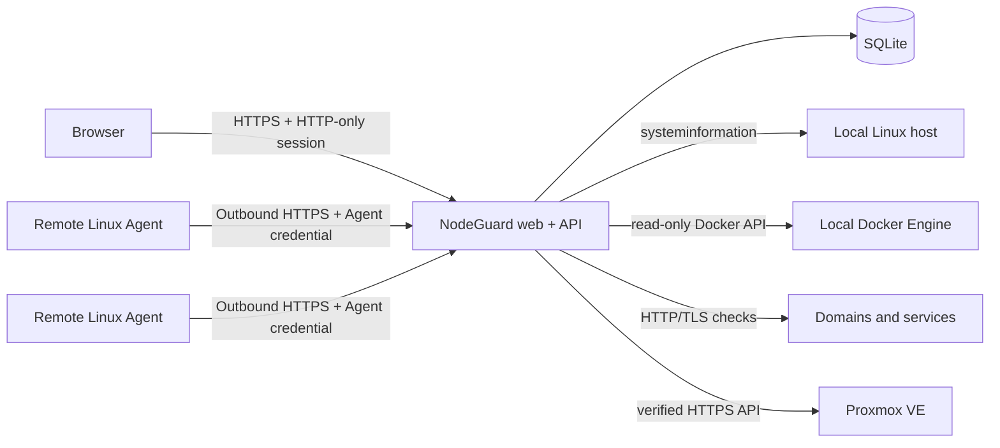

<!-- Product screenshots use only NodeGuard's isolated fictional demo data. -->

<div align="center">

# NodeGuard

### Monitor your servers. Protect your stack.

**A self-hosted, read-only monitoring platform for Linux hosts, Docker workloads, Proxmox VE, domains, services, updates, and alerts.**

[**Live Demo**](https://nodeguard.muthu.eu) · [**Quick Start**](#quick-start) · [**Agent Setup**](#nodeguard-agent) · [**Architecture**](#architecture)


</div>

<p align="center">
  
</p>

> **Status:** NodeGuard is under active development and runs against a real self-hosted homelab. The public demo and all screenshots use a backend-isolated fictional environment.

NodeGuard answers the day-to-day questions that matter in a homelab without becoming a remote-administration plane: which machines are unhealthy, which workloads stopped, which endpoints are slow, which certificates need attention, what updates are available, and when an incident began.

## Highlights

- Unified health overview for Linux machines, Agents, Docker, domains, updates, alerts, and Proxmox VE.
- Outbound-only Go Agent with one-time enrollment, per-machine credentials, stable machine identity, retry buffering, and systemd packaging.
- Persistent and bounded SQLite history for resource metrics, service checks, alert lifecycle, inventories, and integration state.
- Read-only Docker, Proxmox, and APT visibility—no shell, reboot, package installation, or workload lifecycle controls.
- Responsive React interface with dense tables on desktop and compact cards on mobile.
- Server-enforced Demo Mode containing sanitized fictional data.
- Single-image Docker deployment with health checks, graceful shutdown, persistent storage, and documented backup/restore.
- API/web unit tests, Chromium end-to-end coverage, Go validation, generated contract drift checks, and GitHub Actions CI.

## NodeGuard in action

<p>
  
  <br>
  <sub><strong>Machines:</strong> Host inventory, hardware, Docker availability, current resources, and persisted history.</sub>
</p>

<p>
  
  <br>
  <sub><strong>Proxmox VE:</strong> Read-only connection, node, guest, storage, capacity, and synchronization health.</sub>
</p>

<p>
  
  <br>
  <sub><strong>Node overview:</strong> Current platform, hardware, capacity, storage, and available telemetry.</sub>
</p>

<p>
  
  <br>
  <sub><strong>Node history:</strong> On-demand Proxmox RRD charts across selectable time ranges.</sub>
</p>

<p>
  
  <br>
  <sub><strong>Containers:</strong> Searchable, host-scoped Docker inventory with runtime state kept distinct from health.</sub>
</p>

<p align="center">
  
  <br>
  <sub><strong>Mobile:</strong> The same operational summary without horizontal scrolling.</sub>
</p>

## Live demo

Open **[nodeguard.muthu.eu](https://nodeguard.muthu.eu)** and sign in with:

```text
Username: demo
Password: demo
```

Demo data is selected by the authenticated account and enforced at the API boundary. It contains fictional hosts, services, workloads, metrics, updates, and alerts, and cannot access live integration settings or infrastructure mutations.

## Features

### Dashboard and machines

- Overall infrastructure status, primary issue, active incidents, reachability, update totals, and recent alerts.
- Local-host metrics collected with `systeminformation` plus remote Agent hosts.
- CPU, memory, disk, and swap summaries with `1h`, `6h`, `24h`, `7d`, and `30d` history.
- Additional NodeGuard backend or plain health-URL monitors.
- Per-monitor self-signed HTTPS support for trusted internal services without disabling TLS verification globally.

### NodeGuard Agents

- Short-lived, hashed, single-use enrollment tokens.
- Random stable installation identity, stored separately from credentials and never inferred from hostname.
- Unique revocable credential per Agent; only its hash is stored by the API.
- Outbound HTTPS only—no inbound listener, SSH, remote shell, or arbitrary command channel.
- Linux inventory, CPU, memory, disk, swap, network, Docker metadata, and APT update discovery.
- Heartbeat-based online, stale, and offline states.
- Bounded in-memory delivery queue with backoff during temporary failures.
- Checksum-verified static Linux `amd64` and `arm64` releases and a hardened systemd service.
- Transactional exact-identity re-enrollment, credential rotation, revocation, diagnostics, and safe uninstall.

### Docker containers

- Local and Agent-reported read-only Docker inventory.
- Search, filters, sorting, desktop tables, and responsive mobile cards.
- Runtime state, Docker health, host, stack, image, network, ports, uptime, details, and bounded log previews.
- Monitored-container checks for expected workloads.
- No start, stop, restart, delete, exec, prune, or volume actions.

### Domains and services

- Public domains, internal endpoints, reverse proxies, and custom paths.
- Configurable expected HTTP status codes.
- Availability, response time, latency trend, rolling uptime, SSL state, and expanded diagnostics.
- Add, duplicate, edit, delete, and manually re-check monitor configurations.
- Minute-sampled, retention-bounded history.

### Proxmox VE

- Multiple read-only Proxmox connections using dedicated API tokens.
- Nodes, QEMU virtual machines, LXC containers, storage pools, and health summaries.
- Current node detail plus on-demand RRD history for `1h` through `90d` ranges.
- Encrypted token secrets and custom CA certificates; HTTPS verification is always required.
- Background synchronization with non-overlapping runs, stale-snapshot preservation, and failure thresholds.
- No guest lifecycle actions, console, shell, migration, backup, or update controls.

See **[`docs/PROXMOX.md`](docs/PROXMOX.md)** for permissions, private-CA setup, data sources, security boundaries, and limitations.

### Alerts and update discovery

- Active, resolved, and complete alert history with first/last seen, occurrence count, failed checks, likely causes, and suggested actions.
- Persistent dismissal/deletion and deduplication of recurring incidents.
- Agent-reported Debian, Ubuntu, and Proxmox VE APT inventories.
- Available, security-origin, reboot-required, unsupported, busy, failed, retained, stale, and offline states.
- Fixed, shell-free discovery commands with bounded output; raw package-manager output is never sent to the browser.
- Discovery only: NodeGuard never installs packages or reboots a machine.

See **[`docs/MACHINE_UPDATES.md`](docs/MACHINE_UPDATES.md)** for the update protocol and failure behavior.

### Settings and diagnostics

- Session details, refresh controls, screenshot privacy, and sanitized diagnostics export.
- Owner-managed Agent enrollment and credential lifecycle.
- Encrypted Proxmox integration configuration.
- Account-enforced Live and Demo data modes.

## Architecture



### Components

| Component | Location | Responsibility |
|---|---|---|
| Web dashboard | `apps/web` | React 19 SPA, responsive UI, TanStack Query server state, Zustand settings, demo presentation |
| API | `apps/api` | Express authentication, validation, monitoring, integrations, Agent ingestion, static web serving |
| Database | `apps/api/src/services/database.ts` | SQLite schema, migrations, prepared access, transactions, and legacy imports |
| Linux Agent | `agent` | Linux/Docker/APT collection, scheduling, retry queue, authentication, systemd lifecycle |
| Agent contract | `contracts/agent-contract.json` | Canonical ingestion paths and drift-sensitive protocol constants generated for Go and TypeScript |
| Deployment | `Dockerfile`, `docker-compose.yml` | Multi-stage Agent/web/API build and single-container runtime |

### Trust boundaries

- Human users authenticate with username/password sessions in HTTP-only cookies.
- Agents authenticate independently with a per-machine bearer credential.
- Stable machine identity is non-secret and never authenticates requests.
- Integration credentials are encrypted with AES-256-GCM and never returned after storage.
- The browser never connects directly to Docker, Proxmox credentials, SSH, a shell, or the Docker socket.
- Demo sessions are blocked from live data, integration management, and diagnostics.
- The optional legacy API key exists for compatible machine callers and should be treated as a privileged secret.
- NodeGuard is deliberately observational; remediation stays in the system that owns the workload.

### Persistence and lifecycle

SQLite is authoritative for users and sessions, monitor configuration, domain history, metric history, alerts, Agent enrollment and credentials, inventories, updates, and Proxmox snapshots/settings. Legacy JSON server-monitor data is imported once when present; remote monitor API keys are encrypted before persistence.

The API exports an application factory for isolated tests. Production startup initializes the owner, removes expired sessions, starts metric retention sampling and Proxmox synchronization, then listens for HTTP traffic. `SIGINT` and `SIGTERM` stop HTTP intake, drain background work, close SQLite, and enforce a bounded shutdown deadline.

Metric and check histories use sampling and retention limits. Raw Agent metrics are pruned with the same configurable retention horizon as minute history. Update inventory stores only the latest bounded result per Agent.

## Repository layout

```text
NodeGuard/
├── .github/
│   ├── FUNDING.yml                 # GitHub funding metadata
│   └── workflows/
│       ├── ci.yml                  # API/web/contracts/Playwright CI
│       └── agent-release.yml       # Go validation and Agent release assets
├── apps/
│   ├── api/
│   │   ├── src/app.ts              # Express application factory and route ordering
│   │   ├── src/index.ts            # Production startup and graceful shutdown
│   │   ├── src/config/             # Environment and CORS policy
│   │   ├── src/middleware/         # Human/Agent auth and error handling
│   │   ├── src/routes/             # HTTP route groups
│   │   ├── src/services/           # Database, monitoring, crypto, Proxmox, alerts, Agents
│   │   ├── src/cli/                # Backup, verification, and restore CLI
│   │   └── tsconfig.*.json          # Separate production and test builds
│   └── web/
│       ├── e2e/                    # Playwright fixtures and browser scenarios
│       ├── public/                 # Static public assets
│       └── src/
│           ├── app/                # SPA shell and shared application UI
│           ├── api/                # API client and endpoint definitions
│           ├── components/         # Shared and Proxmox components
│           ├── hooks/              # TanStack Query orchestration
│           ├── pages/              # Dashboard, Machines, Agents, Containers, Domains, Updates, Alerts, Settings
│           ├── store/              # Persisted UI settings
│           ├── styles/             # Design, density, controls, motion, and page styles
│           └── utils/              # Formatting, status, routing, and presentation helpers
├── agent/
│   ├── cmd/nodeguard-agent/        # Agent CLI entry point
│   ├── internal/                   # Client, collectors, config, identity, runner, queue, updates
│   ├── packaging/                  # systemd service
│   ├── tests/                      # Installer integration test
│   ├── install-agent.sh            # Public bootstrap wrapper
│   └── install.sh                  # Installer implementation
├── contracts/                      # Canonical cross-language Agent constants
├── docs/                           # Backup, Proxmox, updates, and UI documentation
├── scripts/                        # Contract generation and drift tests
├── screenshots/                    # Sanitized README/product images
├── .env.example                    # Safe configuration template
├── Dockerfile                      # Production multi-stage image
├── docker-compose.yml              # Single-instance deployment
├── playwright.config.ts            # Isolated Chromium E2E environment
└── package.json                    # npm workspaces and root commands
```

## Requirements

### Docker deployment

- Docker Engine with Compose v2
- A persistent volume for SQLite
- Strong owner, demo, and integration secrets
- HTTPS reverse proxy and an additional access layer for public exposure

### Source development

- Node.js 22+
- npm
- Go 1.23+ for Agent changes
- Chromium installed through Playwright for browser tests

## Quick start

### Local development

```bash
git clone https://github.com/HackintoshMatrix7132/NodeGuard.git
cd NodeGuard
npm install
cp .env.example apps/api/.env
```

At minimum, replace these values in `apps/api/.env`:

```env
NODE_ENV=development
NODEGUARD_HOST=0.0.0.0
PORT=3000
NODEGUARD_ADMIN_USERNAME=admin
NODEGUARD_ADMIN_PASSWORD=choose_a_strong_local_password
NODEGUARD_DEMO_USERNAME=demo
NODEGUARD_DEMO_PASSWORD=demo
NODEGUARD_INTEGRATION_SECRET=replace_with_at_least_32_random_bytes
ALLOWED_ORIGINS=http://localhost:3000,http://localhost:5173
DATABASE_URL=file:data/nodeguard.sqlite
```

Generate the integration secret with `openssl rand -hex 32`, then start both workspaces:

```bash
npm run dev
```

Open `http://localhost:5173`. The frontend development server calls the API on port `3000`.

### Production with Docker Compose

```bash
cp .env.example .env
```

Set strong values for `NODEGUARD_ADMIN_PASSWORD`, `NODEGUARD_DEMO_PASSWORD`, and `NODEGUARD_INTEGRATION_SECRET`, then run:

```bash
docker compose up -d --build
docker compose ps
docker compose logs -f nodeguard
```

NodeGuard listens on port `3000`. The named `nodeguard-data` volume is mounted at `/data`; the local Docker socket is mounted read-only for metadata collection. A read-only socket mount is still highly privileged, so deploy only on a trusted host and remove that mount if local Docker visibility is unnecessary.

Stop the service gracefully with:

```bash
docker compose down
```

For public access, terminate HTTPS at a reverse proxy and add Cloudflare Access, a VPN, or another real access layer. Configure `TRUST_PROXY` for the exact proxy-hop count and normally leave `SESSION_COOKIE_SECURE=auto`.

## NodeGuard Agent

The API serves the installer and versioned checksummed binaries built into the production image. In **Agents → Add Agent**, create a short-lived enrollment token, then run:

```bash
curl -fsSL https://nodeguard.muthu.eu/install-agent.sh | sudo bash -s -- \
  --server https://nodeguard.muthu.eu
```

Enter the enrollment token at the hidden prompt. For protected unattended automation, use `NODEGUARD_ENROLLMENT_TOKEN` with `--non-interactive`.

The installation manages:

```text
/usr/local/bin/nodeguard-agent
/etc/nodeguard-agent/config.json
/var/lib/nodeguard-agent/machine-id
/etc/systemd/system/nodeguard-agent.service
```

Useful commands:

```bash
nodeguard-agent version
sudo nodeguard-agent status
sudo nodeguard-agent doctor
sudo nodeguard-agent config validate
sudo systemctl status nodeguard-agent
sudo journalctl -u nodeguard-agent -f
```

A normal uninstall preserves the stable machine identity so a later token-authorized reinstall can reclaim the same registration. Purge removes it only after explicit confirmation:

```bash
sudo nodeguard-agent uninstall
sudo nodeguard-agent uninstall --purge
```

Read **[`agent/README.md`](agent/README.md)** for installation, upgrade, recovery, diagnostics, configuration, Docker permissions, and troubleshooting. Manual installation details are in **[`agent/docs/MANUAL_INSTALL.md`](agent/docs/MANUAL_INSTALL.md)**.

## Configuration

`.env.example` is the canonical reference. Important settings include:

| Variable | Purpose |
|---|---|
| `NODEGUARD_HOST`, `PORT` | API bind address and port |
| `NODEGUARD_ADMIN_USERNAME`, `NODEGUARD_ADMIN_PASSWORD` | Live owner credentials; an explicit password is required in production |
| `NODEGUARD_DEMO_USERNAME`, `NODEGUARD_DEMO_PASSWORD` | Isolated demo credentials |
| `NODEGUARD_INTEGRATION_SECRET` | Stable encryption secret for Proxmox and remote-monitor credentials |
| `DATABASE_URL` | SQLite location, such as `file:/data/nodeguard.sqlite` |
| `ALLOWED_ORIGINS` | Comma-separated allowed browser origins |
| `TRUST_PROXY` | Exact trusted reverse-proxy hop count |
| `SESSION_COOKIE_SECURE` | `auto`, `true`, or `false`; `auto` follows Express request security |
| `NODEGUARD_API_KEY` | Optional legacy machine API key |
| `VITE_NODEGUARD_SUPPORT_URL` | Optional public HTTPS support link embedded at build time; never a secret |
| `METRIC_SAMPLE_INTERVAL_SECONDS` | Local metric sampling interval |
| `METRIC_HISTORY_RETENTION_DAYS` | Minute-history and raw Agent-metric retention, minimum 30 days |
| `DOMAIN_CHECK_TIMEOUT_MS` | Domain/service request timeout |
| `AGENT_*_INTERVAL_SECONDS` | Agent reporting and update schedules supplied during enrollment |
| `AGENT_STALE_AFTER_SECONDS`, `AGENT_OFFLINE_AFTER_SECONDS` | Agent liveness thresholds |
| `CPU_*`, `MEMORY_*`, `DISK_*` | Alert thresholds |
| `NODEGUARD_PROXMOX_*` | Proxmox synchronization, failure, storage, and timeout policy |

Never commit `.env`, SQLite databases, tokens, generated diagnostics, logs, or private infrastructure details. Preserve `NODEGUARD_INTEGRATION_SECRET` in backups; changing it makes stored encrypted integration credentials unreadable.

## API overview

<details>
<summary><strong>Public, session, application, integration, and Agent routes</strong></summary>

### Public and authentication

```text
GET  /health
GET  /install-agent.sh
GET  /agent/releases/latest/version
GET  /agent/releases/:version/:asset
GET  /api/auth/me
POST /api/auth/login
POST /api/auth/logout
```

### Live application data

```text
GET    /api/overview
GET    /api/servers
GET    /api/servers/monitors
POST   /api/servers/monitors
PUT    /api/servers/monitors/:id
DELETE /api/servers/monitors/:id
GET    /api/servers/:id
GET    /api/servers/:id/metrics
GET    /api/servers/:id/metrics/history
GET    /api/servers/:id/containers
GET    /api/containers
GET    /api/containers/monitors
POST   /api/containers/monitors
PUT    /api/containers/monitors/:id
DELETE /api/containers/monitors/:id
GET    /api/containers/:id
GET    /api/domains
POST   /api/domains
PUT    /api/domains/:id
DELETE /api/domains/:id
GET    /api/alerts
GET    /api/alerts/:id
DELETE /api/alerts/:id
GET    /api/updates
GET    /api/updates/machines/:agentId
POST   /api/checks/run
```

### Proxmox VE

```text
GET    /api/proxmox
GET    /api/proxmox/connections
GET    /api/proxmox/connections/:id/nodes/:node
GET    /api/proxmox/connections/:id/nodes/:node/history
POST   /api/proxmox/connections/test
POST   /api/proxmox/connections
PUT    /api/proxmox/connections/:id
PATCH  /api/proxmox/connections/:id/enabled
POST   /api/proxmox/connections/:id/sync
POST   /api/proxmox/sync
DELETE /api/proxmox/connections/:id
```

Demo sessions may read fictional Proxmox inventory and node data. Connection management and synchronization require a live owner/admin session.

### Agent administration and ingestion

```text
GET    /api/agents
GET    /api/agents/:id
PUT    /api/agents/:id
GET    /api/agents/enrollment-tokens
GET    /api/agents/enrollment-tokens/:id/status
POST   /api/agents/enrollment-tokens
DELETE /api/agents/enrollment-tokens/:id
POST   /api/agents/:id/rotate-credential
POST   /api/agents/:id/revoke
DELETE /api/agents/:id

POST   /api/agent/register
GET    /api/agent/status
POST   /api/agent/heartbeat
POST   /api/agent/inventory
POST   /api/agent/metrics
POST   /api/agent/docker
POST   /api/agent/updates
```

Application routes use human sessions or the optional legacy API key. Agent ingestion uses dedicated bearer credentials; registration uses a one-time enrollment token.

</details>

## Backup and restore

NodeGuard includes a SQLite-aware maintenance CLI:

```bash
npm run build --workspace apps/api
npm run db:backup --workspace apps/api -- --database file:data/nodeguard.sqlite --output ./backups/nodeguard.sqlite
npm run db:verify --workspace apps/api -- --source ./backups/nodeguard.sqlite
```

The backup command uses SQLite's online backup API and verifies the result. Restore requires the API to be stopped, the literal `--confirm RESTORE`, a verified source, and creates a verified pre-restore recovery copy before atomic replacement.

Follow **[`docs/BACKUP_RESTORE.md`](docs/BACKUP_RESTORE.md)** exactly for Docker-volume backup, off-host storage, restore, and recovery testing. Back up the integration secret separately through your secret-management system.

## Development and validation

Run JavaScript commands from the repository root:

```bash
npm run dev                 # API and Vite development servers
npm run dev:api             # API only
npm run dev:web             # Web only
npm run contracts:generate  # Regenerate tracked Go/TypeScript constants
npm run contracts:check     # Read-only generated-contract drift check
npm run contracts:test      # Contract generator tests
npm run typecheck           # API and web TypeScript
npm run lint                # Web lint/type validation
npm test                    # Contract, API, and web tests
npm run build               # Production API and web builds
npm run test:e2e:install    # Install Playwright Chromium
npm run test:e2e            # Isolated Chromium E2E suite
```

The API uses `tsconfig.build.json` for production code and `tsconfig.test.json` for test output, so tests are not shipped in the production API directory. The Playwright suite starts a loopback-only API with an in-memory SQLite database and a production-built Vite preview. It covers login, protected navigation, safe mutations, responsive layouts, keyboard interaction, console errors, and failed requests.

Validate the Agent from its module directory:

```bash
cd agent
make fmt-check vet test installer-test build-linux-amd64 build-linux-arm64
```

### Continuous integration and releases

- `.github/workflows/ci.yml` runs contract drift checks, API/web typechecking, linting, tests, production builds, and Chromium E2E on pull requests and pushes to `main`.
- `.github/workflows/agent-release.yml` runs shell validation plus Go formatting, vetting, tests, installer tests, and cross-architecture release builds.
- Tags matching `agent-v*` publish the checksummed Agent binaries to a GitHub release. Pull requests build artifacts without publishing a release.

## Security

- Use HTTPS for every non-loopback Agent and every non-local deployment.
- Put publicly reachable NodeGuard instances behind an identity-aware proxy, VPN, or equivalent access layer.
- Use strong, unique owner/demo passwords and a stable high-entropy integration secret.
- Passwords use scrypt hashes; sessions use HTTP-only cookies and configurable secure-cookie behavior.
- Helmet, request-size limits, CORS/origin policy, and rate limits protect the API boundary.
- Enrollment tokens are hashed, single-use, short-lived, and revocable.
- Agent credentials are unique, stored as hashes server-side, and excluded from logs and client responses.
- Proxmox and remote server-monitor secrets are encrypted at rest and authorization headers are stripped on cross-origin redirects.
- TLS verification remains enabled; private Proxmox CAs are configured explicitly.
- Docker socket access remains highly privileged even with a read-only mount.
- NodeGuard does not replace network segmentation, host hardening, access control, or tested backups.

See **[`agent/docs/SECURITY.md`](agent/docs/SECURITY.md)** and **[`docs/PROXMOX.md`](docs/PROXMOX.md)** for subsystem-specific boundaries.

## Known limitations

- SQLite is intended for one homelab deployment, not a horizontally scaled cluster.
- Local-backend per-container CPU is unavailable; Agents report it only when Docker provides a valid one-shot sample.
- Alert history exists, but push, email, and mobile notifications are not implemented.
- The Agent retry queue is memory-only and is lost when the process restarts.
- APT is the only package-update provider today.
- Proxmox node history is fetched on demand from RRD and is not stored as a second time-series database.
- NodeGuard has no multi-user team administration, password reset, or two-factor authentication.
- Monitoring and diagnostics are read-only; NodeGuard does not remediate incidents.

## Documentation

| Document | Topic |
|---|---|
| [`agent/README.md`](agent/README.md) | Agent installation, operation, recovery, upgrade, and troubleshooting |
| [`agent/docs/SECURITY.md`](agent/docs/SECURITY.md) | Agent threat model and security boundaries |
| [`agent/docs/MANUAL_INSTALL.md`](agent/docs/MANUAL_INSTALL.md) | Manual Agent installation |
| [`agent/docs/UPGRADE.md`](agent/docs/UPGRADE.md) | Agent upgrade workflow |
| [`agent/docs/TROUBLESHOOTING.md`](agent/docs/TROUBLESHOOTING.md) | Agent diagnostics |
| [`docs/PROXMOX.md`](docs/PROXMOX.md) | Proxmox setup, permissions, TLS, data, and operations |
| [`docs/MACHINE_UPDATES.md`](docs/MACHINE_UPDATES.md) | APT inventory architecture and states |
| [`docs/BACKUP_RESTORE.md`](docs/BACKUP_RESTORE.md) | Consistent SQLite backup, verification, restore, and recovery |

## Contributing

Keep changes within the active web, API, Agent, and deployment architecture. Preserve read-only behavior, update tests and documentation together, and run the applicable validation commands above. Do not commit `.env`, databases, tokens, logs, generated build output, or private infrastructure data.

## Support NodeGuard

NodeGuard is an independent project. Support helps cover hosting and continued development.

[](https://ko-fi.com/hackintoshmatrix)

## License

NodeGuard is available under the [MIT License](LICENSE).

---

<div align="center">

**NodeGuard — clear, read-only infrastructure visibility for self-hosted environments.**

[Live Demo](https://nodeguard.muthu.eu) · [Back to top](#nodeguard)

</div>
